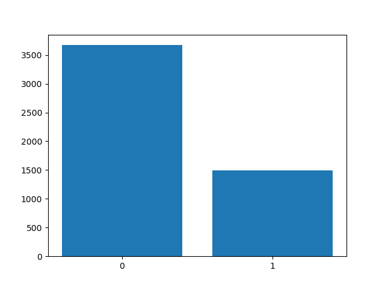
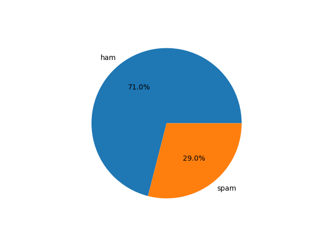
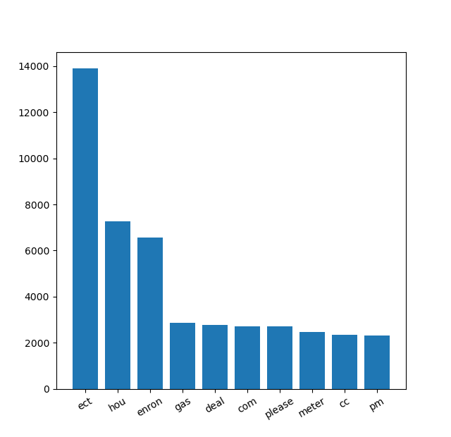
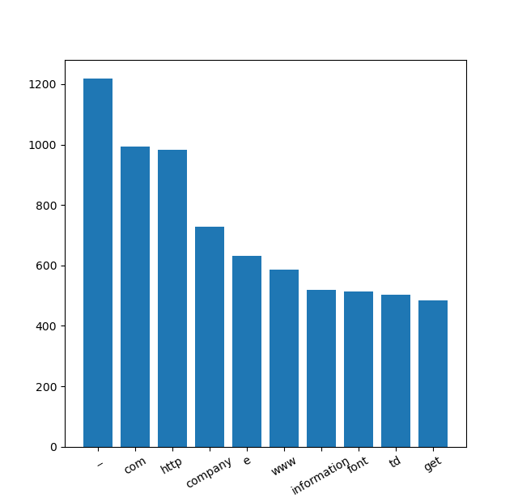
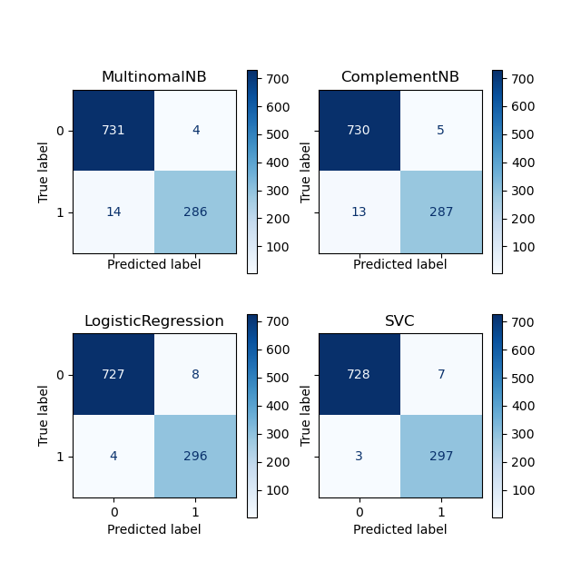
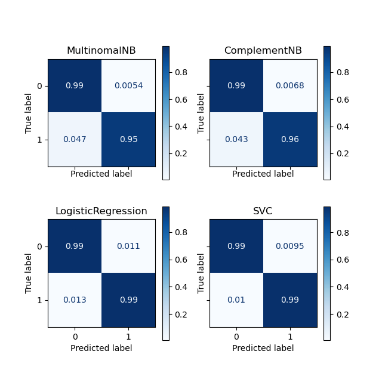

---
title: Spam filter
author: Vesna Zupanc
date: 31.8.2020
...

# Uvod

V sklopu predmeta Uvod v strojno učenje želimo zgraditi t.i. *spam filter*, s pomočjo katerega bomo filtrirali
neželjeno elektronsko pošto. Nabor podatkov, ki je uporabljen v nalogi je možno pridobiti na 
[spletni strani kaggle](https://www.kaggle.com/venky73/spam-mails-dataset), od koder si jih lahko shranimo v csv formatu.

Pogledali si bomo več različnih pristopov oz. modelov, ter se na koncu odločili za najboljšega.

# Priprava podatkov
## Pregled surovih podatkov

Poglejmo si, katere stolpce, koliko podatkov in koliko od teh neničelnih vsebujejo naši podatki.

```
<class 'pandas.core.frame.DataFrame'>
RangeIndex: 5171 entries, 0 to 5170
Data columns (total 4 columns):
  #   Column      Non-Null Count  Dtype
---  ------      --------------  -----
  0   Unnamed: 0  5171 non-null   int64
  1   label       5171 non-null   object
  2   text        5171 non-null   object
  3   label_num   5171 non-null   int64
dtypes: int64(2), object(2)
memory usage: 161.7+ KB
```

Vidimo, da imamo 5171 vnosov in nič ničelnih vrednosti. Obržali bomo stolpce *text* in *label_num*, ki pa ga
bomo preimenovali v *label*. 

Tako dobimo tabelo z dvema stolpcema:

* text (*str*) - email sporočilo
* label (*int*) - indikator ali je sporočilo neželjeno (0, če je 'ham' in 1, če je 'spam')

Prvi dve vrstici tabele sta prikazani v spodnji tabeli. 

Table: Prvi dve vrstici podatkov

+----+---------------------------------------------------------------------------------+---------+
|    | text                                                                            |   label |
+====+=================================================================================+=========+
|  0 | Subject: enron methanol ; meter # : 988291                                      |       0 |
|    | this is a follow up to the note i gave you on monday , 4 / 3 / 00 { preliminary |         |
|    | flow data provided by daren } .                                                 |         |
|    | please override pop ' s daily volume { presently zero } to reflect daily        |         |
|    | activity you can obtain from gas control .                                      |         |
|    | this change is needed asap for economics purposes .                             |         |
+----+---------------------------------------------------------------------------------+---------+
|  1 | Subject: hpl nom for january 9 , 2001                                           |       0 |
|    | ( see attached file : hplnol 09 . xls )                                         |         |
|    | - hplnol 09 . xls                                                               |         |
+----+---------------------------------------------------------------------------------+---------+

Na naslednjm grafu je prikazana še porazdelitev naših podatkov.



Vidimo, da imamo veliko več 'ham' sporočil kot 'spam', zato bomo morali biti pozorni pri deljenju podatkvo na
učno in testno množico, saj si bomo želeli obdržati razmerje. Na spodnjem tortnem diagramu so prikazani še pripadajoči
deleži sporočil, ki spadajo pod 'ham' ali 'spam'.



## Analiza in čiščenje besedila

Naš cilj je poiskati pogostost besed v 'spam' in 'ham' sporočilih, saj bomo na podlagi tega tudi zgradili model 
za filtriranje pošte. Vhodni podatek modelov bodo torej besede v sporočilu. Še preden pa besede štejemo, moramo prečistiti 
sporočila. Vse besede bomo zapisali z malimi tiskanimi črkami, odstranili bomo števila, ločila, in pa nekatere besede. 
Sporočila oz. tekst na splošno vsebuje veliko t.i. 'stopwords', ki pa so značilne za vsak jezik posebej. 
V našem primeru imamo sporočila v angleškem jeziku, zato bomo definirali stopwords temu primerno. 

Primer besed, ki jih bomo odstranili:

> 'themselves', 'all', 'or', 'couldn', "wouldn't", 'with', 'here', 'up', 'mustn', ...

V seznam besed smo dodali še besedo 'subject', saj se ta nahaja v vsakem sporočilu in zato ni ključna pri
klasifikaciji sporočila. 

V spodnji tabeli sta prikazani prvi dve vrstici nove tabele s prečiščenim besedilom.
\pagebreak

Table: Prvi dve vrstici prečiščenih podatkov

+----+-------------------------------------------------------------------------------------------------------------------------------------------------------------------------------------------------------------------+---------+
|    | text                                                                                                                                                                                                              |   label |
+====+===================================================================================================================================================================================================================+=========+
|  0 | enron methanol meter follow note gave monday preliminary flow data provided daren please override pop daily volume presently zero reflect daily activity obtain gas control change needed asap economics purposes |       0 |
+----+-------------------------------------------------------------------------------------------------------------------------------------------------------------------------------------------------------------------+---------+
|  1 | hpl nom january see attached file hplnol xls hplnol xls                                                                                                                                                           |       0 |
+----+-------------------------------------------------------------------------------------------------------------------------------------------------------------------------------------------------------------------+---------+

Poglejmo si še, katere besede so najbolj pogoste v 'ham' ali v 'spam' sporočilih. Na naslednjem grafu je prikazanih prvih
10 besed, glede na njihovo pogostost v 'ham' sporočilih, s pripadajočo frekvenco.



Poglejmo si še enak prikaz za sporočila, ki so klasificirana kot 'sam':



## Priprava besedila za ML algoritem

Ker računalnik ne zaznava besed na enkat način kot mi, moramo text prevesti na numerične vektorje.
V ta namen bomo uporabiloi `CountVectorizer` ali `TfidfVectorizer`, odvisno od modela. Obe sta metodi za pretvorbo
besedil v vektorje. Razlika med njima je, da pri `CountVectorizer` enostavno preštejemo, kolikokrat se beseda v 
dokumentu pojavi, medtem ko `TfidfVectorizer` upošteva tudi skupno težko besede v dokumentu. To nam pomaga pri obravnavanju
redkih besed, ki so zaradi nekih splošnih zelo pogostih besed lahko zasenčene in njihov vpliv ni zaznan. 

# Izdelava modelov

Kot smo že povedali v uvodu, bomo pogledali več različnih modelov in jih med seboj primerjali. 
Pogledali bomo:

* Naive Bayes klasifikator (CountVectorizer)
* Complement Naive Bayes klasifikator (CountVectorizer)
* LogisticRegression (LogisticRegression)
* SVC (TfidfVectorizer)

Večino modelov smo že spoznali na predavanjih, mogoče je vredno samo povedati razliko med Naive Bayes klasifikator
in Complement Naive Bayes klasifikator. Complement Naive Bayes klasifikator je bil ustvarjen prav za namen,
ko podatki v učni množici niso v ravnovesju. Tako lahko v našem primeru pričakujemo, da bo deloval boljše.

## Rezultati in primerjava modelov

Za primerjavo modelov bomo gledali konfuzijsko matriko oz. matriko klasifikacij. Poleg konfuzijske matrike pa lahko izračunamo tudi preciznost, priklic in pa F-mero. 

Preciznost nam pove, kakšen procent naše napovedi je bil pravilen. Priklic nam pove koliko pozitivnih primerov smo 
procentualno napovedali pravilno, F-mera pa nam pove, kolišen procent pozitivnih napovedi je bil pravilen. 

Poglejmo si najprej sliko konfuzijskih matrik.



Hitro lahko opazimo, da imata Naive Bayes klasifikatorja nekoliko več napačno negativnih vrednosti in nekoliko manj 
pravilno negativnih. Za lažjo predstavo pa si poglejmo še normalizirano konfuzijsko matriko po vrsticah.



Ugotovitev je enaka kot prej, vseeno pa vidimo da se vsi modeli dobro obnesejo. Poleg prejšnjega opažanja pa 
sedaj (lažje) vidimo tudi, da imata Naive Bayes klasifikatorja manj lažno pozitivnih primerov. To pomeni, da 
manj sporočil, ki niso 'spam' filtrirata v 'spam'. 

Poglejmo si še omenjene tri metrike za izbrane modele.  
\pagebreak

Table: Metrike modela

+---------+--------------+-----------+----------+
| Model   |   Preciznost |   Priklic |   F-mera |
+=========+==============+===========+==========+
| NB      |       0.9862 |    0.9533 |   0.9695 |
+---------+--------------+-----------+----------+
| CNB     |       0.9829 |    0.9567 |   0.9696 |
+---------+--------------+-----------+----------+
| LR      |       0.9737 |    0.9867 |   0.9801 |
+---------+--------------+-----------+----------+
| SVC     |       0.977  |    0.99   |   0.9834 |
+---------+--------------+-----------+----------+

Na podlagi teh rezultatov bi se odločili za SVC. Vendar pa je to le ena možnih razdelitev testne in učne množice,
zato bomo pred končno izbiro pogledali še rezultate k-navzkrižnega preverjanja. Za k bomo vzeli 6, gledali pa bomo F-mero.

Rezultati so prikazani v spodnji tabeli. 

Table: Rezultati k-kratnega navzkrižnega preverjanja

+---------+---------+
| Model   |   Score |
+=========+=========+
| NB      |  0.9686 |
+---------+---------+
| CNB     |  0.9716 |
+---------+---------+
| LR      |  0.9753 |
+---------+---------+
| SVC     |  0.9795 |
+---------+---------+

Na podlagi k-kratnega navzkrižnega preverjanja smo prišli do enakega zaključka kot že s prvotno razdelitvijo
učne in testne množice. V našem primeru bi torej izbrali SVC. 

